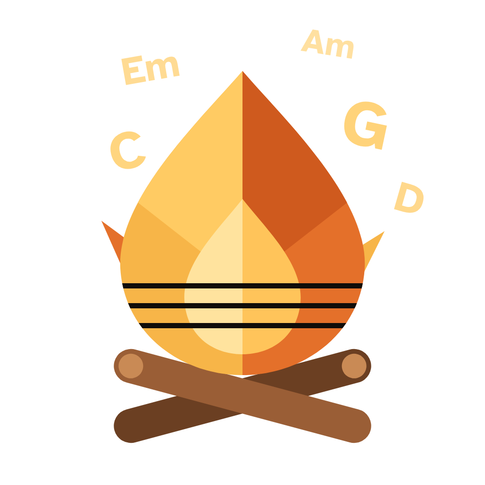
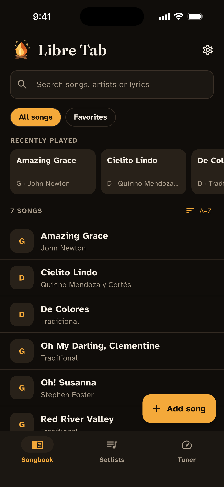
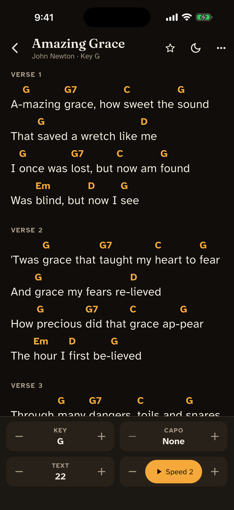
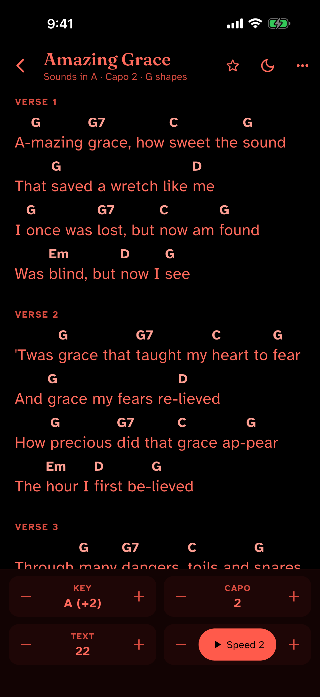
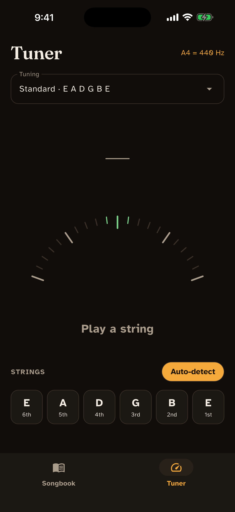
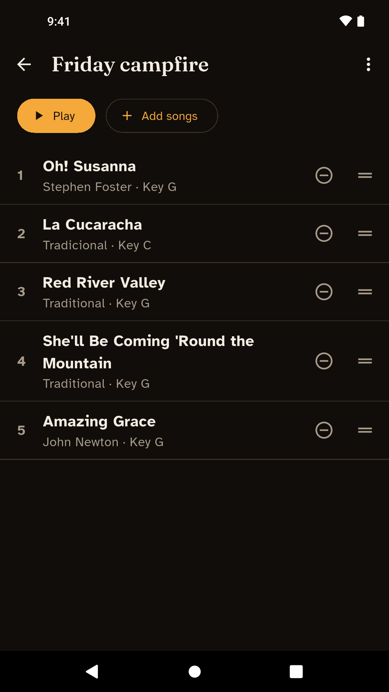
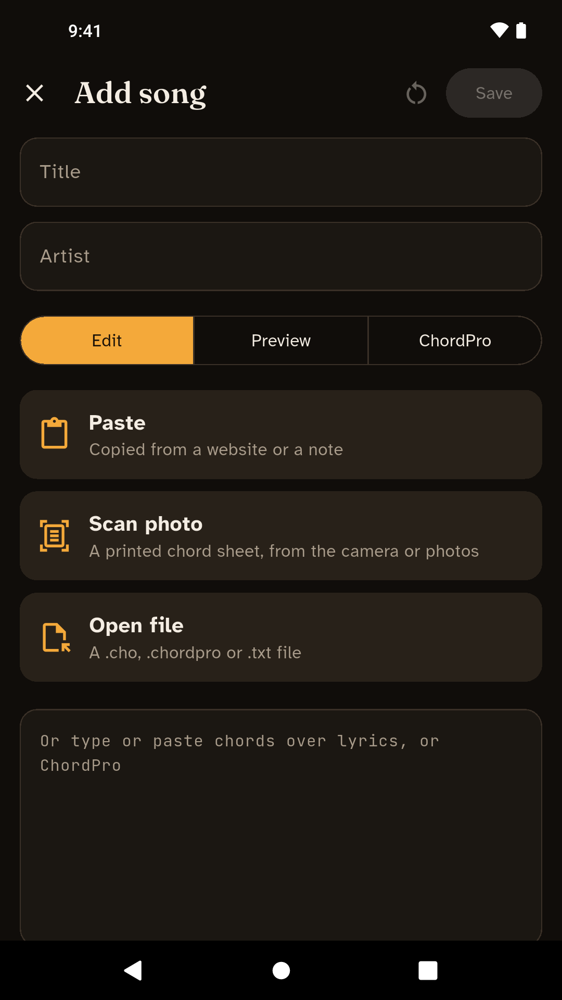
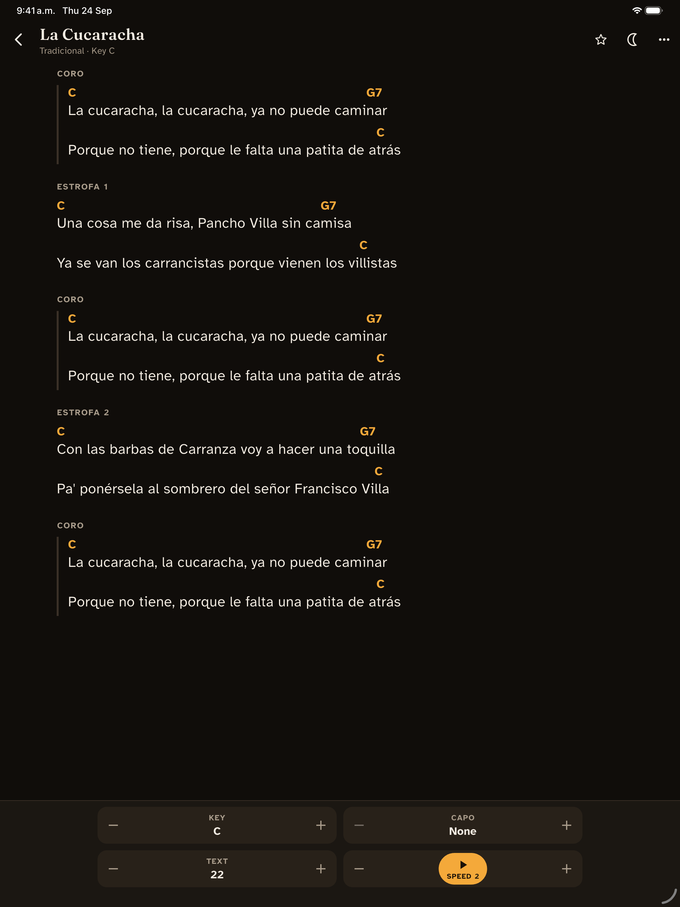

<p align="center">
  
</p>

# Libre Tab

A songbook and guitar tuner for playing around the campfire. It works fully
offline: no account, no ads, no tracking.

<p align="center">
  
  
  
  
</p>

<p align="center">
  
  
  
</p>

## Features

**Songbook**
- Chords above the lyrics, big enough to read at night.
- Hands-free auto-scroll: tap the lyrics to pause; the speed is remembered
  per song. While it plays, the controls fold away so the song gets the
  screen, and a thin line shows how far through it you are.
- Transpose, capo ("Sounds in A · Capo 2 · G shapes"), and a chord diagram
  for any chord you tap.
- Search by title, artist or a line of the lyrics (accents and apostrophes
  don't matter).
- **Recently played** at the top, and sort by title, artist, recent or most
  played ("Played 12×"); an A–Z index for long songbooks. All of it stays
  on your phone.
- Favorites, and **setlists** in their own tab: reorder by dragging, swipe
  from one song to the next while playing, and "Up next" at the end of each
  song. Let auto-scroll run and it moves on to the next song by itself
  (with "Stay" to hold on).
- Swipe a song left for quick actions: add to a setlist, share, or delete
  (with Undo).
- Dark, **red night** and light themes: one tap on the moon for red night
  and back, a long press for all three. The screen stays on while a song is
  open.

**Adding songs**
- **Scan a song sheet** with the camera or from your photos. Text is read on
  the phone (Apple Vision on iPhone, Tesseract on Android) and each chord is
  placed over the syllable under it, even in proportional printed fonts.
- **Paste** a song copied from a website or a note in one tap;
  chords-over-lyrics is converted to ChordPro, with Edit / Preview / ChordPro
  tabs.
- Open `.cho`, `.chopro`, `.chordpro`, `.crd` or `.txt` files, including
  straight from Files, Mail, Safari or a chat app ("Open in Libre Tab" /
  "Share to").
- Seven public-domain campfire songs to start with (English and Spanish).

**Your data**
- Export the whole songbook as a `.zip` of `.cho` files, and import it on
  another phone. Importing the same backup twice adds nothing.
- Find duplicates: exact copies are merged, keeping their favorite star and
  setlist places; different versions are listed for you to compare.
- Delete all songs, with a clear confirmation, an "Export first" option and
  Undo.

**Tuner**
- Standard, half step down, Drop D, DADGAD, Open G and Open D.
- Auto-detects the string, or lock onto one string. A needle with a ±5 cent
  "in tune" zone, and a haptic tap when a string is in tune.
- Shows it's listening before a note is found, ticks each string once it's
  in tune, and when all six are: "All tuned — let's play!" with your last
  song a tap away.
- Reference pitch from 432 to 446 Hz.
- Only listens while the tuner is on screen; nothing is recorded.

Songs are stored in the open [ChordPro](https://www.chordpro.org/) format, so
your songbook is never locked into this app. The app is in English and
Spanish.

## Status

All seven milestones are done: screen design, scaffold, music core, songbook,
campfire mode, tuner, polish (setlists, starter songs, export/import, app icon
and brand, store listing), and camera import; since then, a UI round (play
history and sorting, a Setlists tab, auto-advance, tuner feedback, a
paste-first editor, motion and the in-app logo). It runs on iPhone and iPad
and has been tested on Android 13 (emulator). 520+ tests pass.

See the [roadmap](docs/TECH_STACK.md#10-milestones).

## Platforms

iOS 14+ (iPhone and iPad) and Android 7.0+ (API 24).

## Development

Requirements: Flutter 3.47+ (Dart 3.13+), Xcode for iOS, Android SDK for
Android.

```bash
flutter pub get
flutter run --release   # on a device (debug builds need the VM service)
flutter test
flutter analyze
dart run build_runner build --delete-conflicting-outputs   # after Drift schema changes
```

Brand and app icon: see [branding/README.md](branding/README.md) (runs
`branding/generate.py`, then `dart run flutter_launcher_icons`).

## Documentation

| Doc | What's in it |
|---|---|
| [docs/TECH_STACK.md](docs/TECH_STACK.md) | Stack, packages, architecture, tuner pipeline, testing, milestones |
| [docs/SONG_FORMAT.md](docs/SONG_FORMAT.md) | The ChordPro subset Libre Tab reads and writes, imports, file types, export/import |
| [docs/DESIGN.md](docs/DESIGN.md) | Navigation, themes, fonts, and every screen: songbook, song view, editor, tuner, setlists, settings |
| [docs/store/listing.md](docs/store/listing.md) | App Store / Google Play text (EN + ES), privacy answers, screenshots |
| [docs/store/app-review.md](docs/store/app-review.md) | App Store submission: build checks, App Store Connect answers, reviewer notes, guideline check |
| [PRIVACY.md](PRIVACY.md) | Privacy statement: no data collected |
| [SECURITY.md](SECURITY.md) | Reporting vulnerabilities, security model, audit results |
| [branding/README.md](branding/README.md) | Logo, app icon, social media versions, colors, taglines |

## Project layout

```
lib/
  app/         router, theme, settings, localization setup
  core/        database (Drift + FTS5), ChordPro, music theory (pure Dart),
               pitch detection, files, shared widgets
  features/    library (songbook, setlists, import/export, duplicates),
               song_view, editor, tuner, settings
  l10n/        English and Spanish strings
assets/        fonts, starter songs, the flame mark
branding/      logo generator and outputs
docs/          design docs, store listing, screenshots
test/          mirrors lib/
```

## License

Copyright (C) 2026 Bruno Fosados

Libre Tab is free software: you can redistribute it and/or modify it under the
terms of the GNU General Public License as published by the Free Software
Foundation, either version 3 of the License, or (at your option) any later
version. See [LICENSE](LICENSE) for the full text.

This program is distributed in the hope that it will be useful, but WITHOUT ANY
WARRANTY; without even the implied warranty of MERCHANTABILITY or FITNESS FOR A
PARTICULAR PURPOSE.

The fonts (Atkinson Hyperlegible, Fraunces, JetBrains Mono) are under the SIL
Open Font License; the starter songs are in the public domain.
